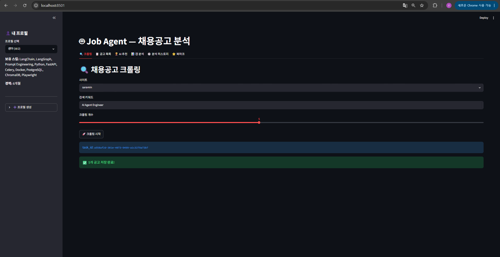
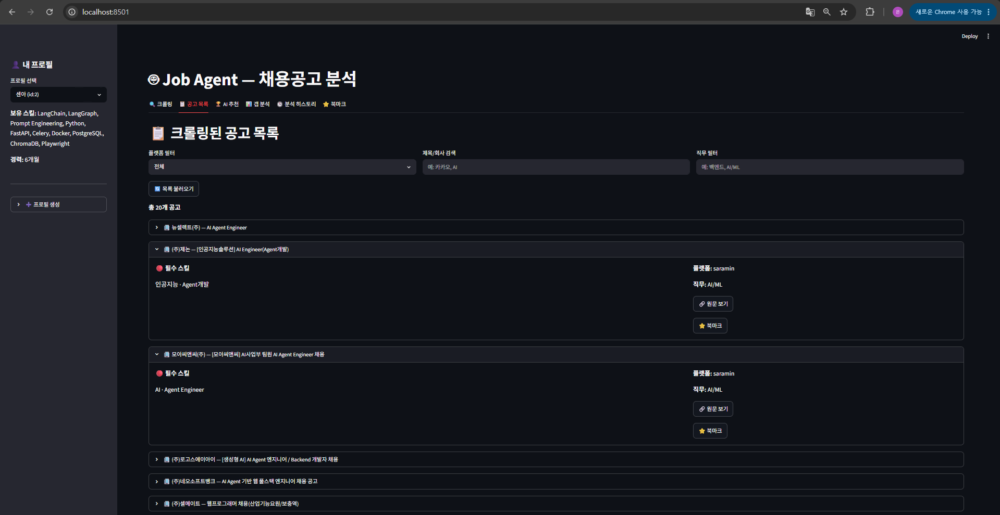
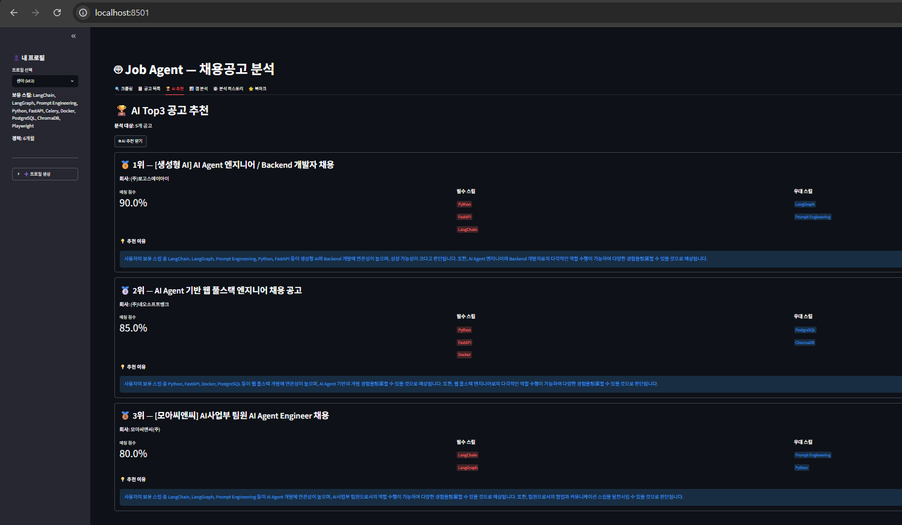
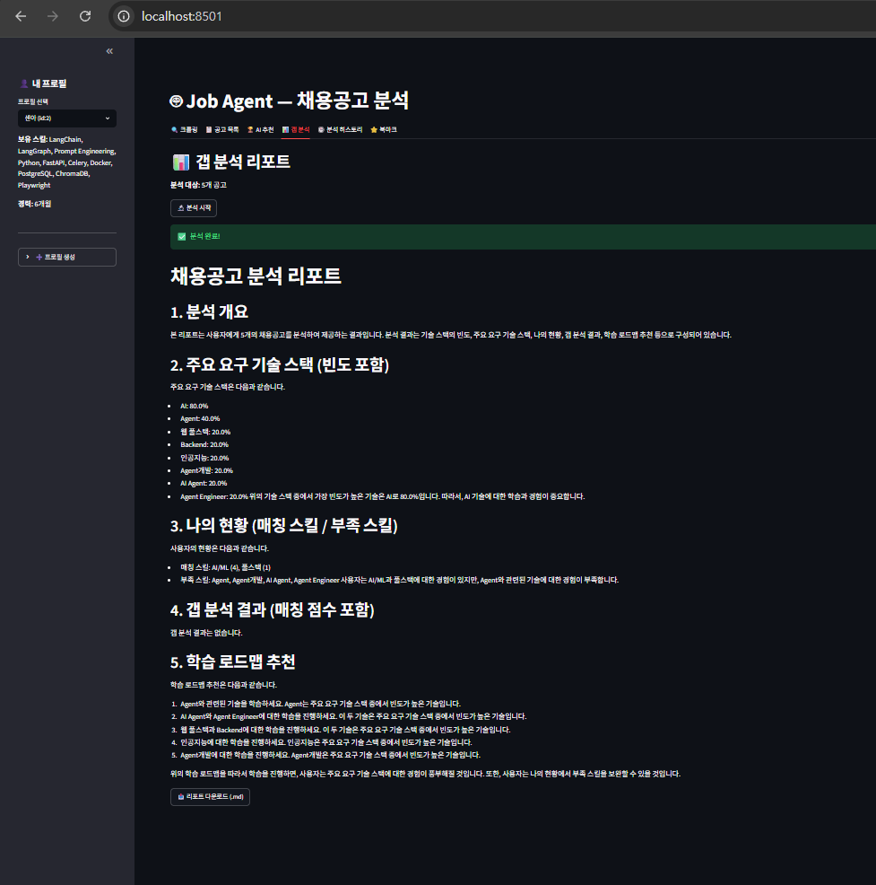
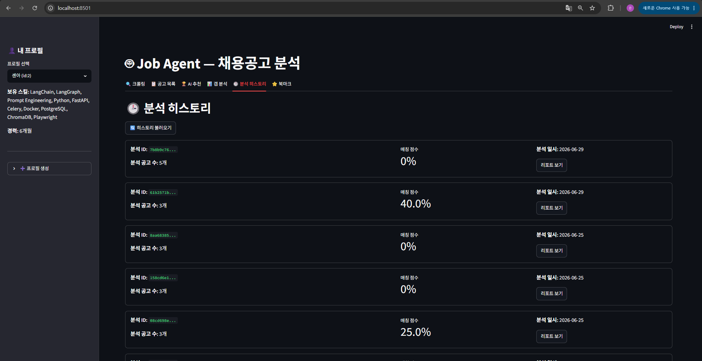
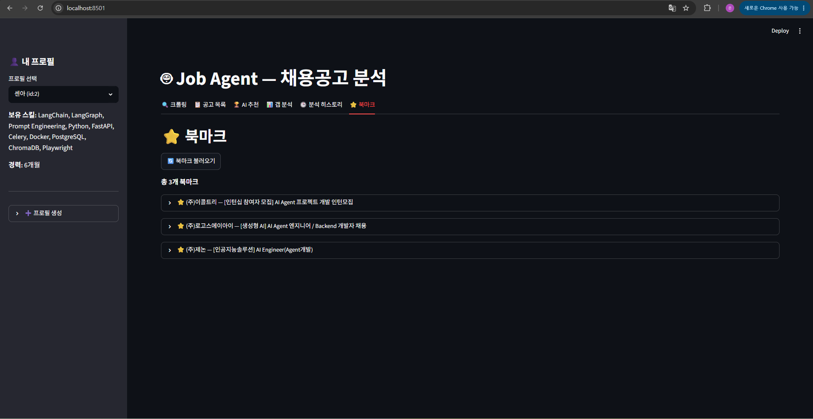

# 🤖 Job Agent — 채용공고 분석 AI 에이전트

> FastAPI + LangGraph 기반 채용공고 자동 크롤링 및 갭 분석 시스템


---

## 📌 프로젝트 개요

채용 플랫폼(사람인/잡코리아)의 공고를 자동 수집하고, LangGraph AI 에이전트가 기술 스택을 분석하여 **내 프로필과의 갭을 리포트**로 생성합니다.

### 핵심 기능
- 사람인/잡코리아 채용공고 자동 크롤링 (Playwright)
- LangGraph 멀티 스텝 에이전트로 키워드 추출 → 스택 분석 → 갭 분석 → 리포트 생성
- Celery + Redis 비동기 태스크 처리 + Flower 모니터링
- AI Top3 공고 추천 (내 프로필 기반)
- 공고 목록 필터링 (플랫폼/키워드/직무)
- 공고 중복 저장 방지
- 분석 히스토리 조회
- 공고 북마크
- Streamlit UI (6탭)

---

## 📸 스크린샷

### 크롤링


### 공고 목록


### AI Top3 추천


### 갭 분석 리포트


### 분석 히스토리


### 북마크


---

## 🏗️ 시스템 아키텍처

```
사용자 (Streamlit UI)
        │
        ▼
  FastAPI Server
  ┌─────────────────────────────┐
  │  POST /jobs/crawl           │
  │  POST /jobs/analyze         │
  │  POST /jobs/recommend       │
  │  GET  /jobs/report/{id}     │
  │  GET  /jobs/history         │
  │  POST /profiles/            │
  │  POST /bookmarks/           │
  └──────────┬──────────────────┘
             │ Celery Task
             ▼
    ┌─────────────────┐
    │  Redis (Broker) │◄── Flower 모니터링 (port 5555)
    └────────┬────────┘
             │
    ┌────────▼────────────────────────┐
    │  Celery Worker                  │
    │                                 │
    │  crawl_jobs_task                │
    │  └── Playwright 크롤러          │
    │       └── 중복 URL 방지         │
    │                                 │
    │  analyze_jobs_task              │
    │  └── LangGraph Agent            │
    │       ├── extract_keywords      │
    │       ├── analyze_stack         │
    │       ├── analyze_gap           │
    │       └── report                │
    └────────┬────────────────────────┘
             │
    ┌────────▼────────┐
    │   PostgreSQL    │
    │  - job_posts    │
    │  - analysis_    │
    │    results      │
    │  - user_        │
    │    profiles     │
    │  - bookmarks    │
    └─────────────────┘
```

---

## 🧠 LangGraph 워크플로우

```
extract_keywords → analyze_stack → analyze_gap → report → END
```

| 노드 | 역할 |
|------|------|
| `extract_keywords` | 공고별 필수/우대 기술 스택, 경력, 직무 추출 |
| `analyze_stack` | 전체 공고 스택 빈도 분석 (예: Python 80%) |
| `analyze_gap` | DB 프로필과 비교하여 보유/부족 스킬 도출 |
| `report` | 마크다운 리포트 생성 (매칭 점수 포함) |

---

## 🛠️ 기술 스택

| 레이어 | 기술 |
|--------|------|
| API 서버 | FastAPI + Uvicorn |
| 비동기 태스크 | Celery + Redis |
| 태스크 모니터링 | Flower |
| AI 에이전트 | LangGraph + LangChain |
| LLM | Groq (llama-3.3-70b-versatile) |
| 크롤링 | Playwright (Chromium) |
| DB | PostgreSQL 15 (Docker) |
| ORM | SQLAlchemy 2.0 (async) |
| 마이그레이션 | Alembic |
| UI | Streamlit |
| 컨테이너 | Docker Compose |

---

## 🚀 빠른 시작

### 1. 환경 설정
```bash
git clone https://github.com/se-ny/job-agent.git
cd job-agent
python -m venv venv
venv\Scripts\activate  # Windows
pip install -r requirements.txt
```

### 2. 환경변수 설정
```bash
cp .env.example .env
# .env 파일에서 GROQ_API_KEY 입력
```

### 3. Docker 실행 (PostgreSQL + Redis)
```bash
docker-compose up -d
```

### 4. DB 마이그레이션
```bash
alembic upgrade head
```

### 5. 서버 실행
```bash
# 터미널 1 — Celery 워커
celery -A app.core.celery_app worker --loglevel=info --pool=solo

# 터미널 2 — FastAPI
uvicorn app.main:app --reload

# 터미널 3 — Streamlit UI
streamlit run streamlit_app.py

# 터미널 4 — Flower 모니터링 (선택)
celery -A app.core.celery_app flower --port=5555
```

---

## 📡 API 엔드포인트

| Method | Endpoint | 설명 |
|--------|----------|------|
| POST | `/jobs/crawl` | 크롤링 태스크 시작 |
| GET | `/jobs/crawl/{task_id}` | 크롤링 결과 조회 |
| POST | `/jobs/analyze` | Agent 분석 태스크 시작 |
| GET | `/jobs/analyze/{task_id}` | 분석 태스크 상태 조회 |
| GET | `/jobs/report/{id}` | 분석 결과 JSON 조회 |
| GET | `/jobs/report/{id}/markdown` | 마크다운 리포트 조회 |
| GET | `/jobs/posts` | 공고 목록 조회 (필터링 지원) |
| POST | `/jobs/recommend` | AI Top3 공고 추천 |
| GET | `/jobs/history` | 분석 히스토리 조회 |
| POST | `/profiles/` | 프로필 생성 |
| GET | `/profiles/` | 프로필 목록 |
| PATCH | `/profiles/{id}` | 프로필 수정 |
| POST | `/bookmarks/` | 북마크 추가 |
| GET | `/bookmarks/{profile_id}` | 북마크 목록 |
| DELETE | `/bookmarks/{id}` | 북마크 삭제 |

---

## 📁 폴더 구조

```
job-agent/
├── app/
│   ├── main.py
│   ├── tasks.py
│   ├── api/
│   │   ├── jobs.py        # 크롤링/분석/리포트/추천/히스토리
│   │   ├── profiles.py    # 사용자 프로필 CRUD
│   │   └── bookmarks.py   # 북마크 CRUD
│   ├── agent/
│   │   ├── graph.py       # LangGraph 워크플로우
│   │   ├── tools.py       # extract/analyze/gap Tool
│   │   └── prompts.py     # 시스템 프롬프트
│   ├── crawler/
│   │   ├── base.py        # BaseCrawler
│   │   ├── saramin.py     # 사람인 크롤러
│   │   └── jobkorea.py    # 잡코리아 크롤러
│   ├── models/
│   │   ├── job_post.py
│   │   ├── analysis.py
│   │   ├── user_profile.py
│   │   └── bookmark.py
│   └── core/
│       ├── config.py
│       ├── database.py
│       └── celery_app.py
├── alembic/
├── docs/
│   └── images/            # 스크린샷
├── streamlit_app.py
├── docker-compose.yml
├── Dockerfile
├── .env.example
└── requirements.txt
```
